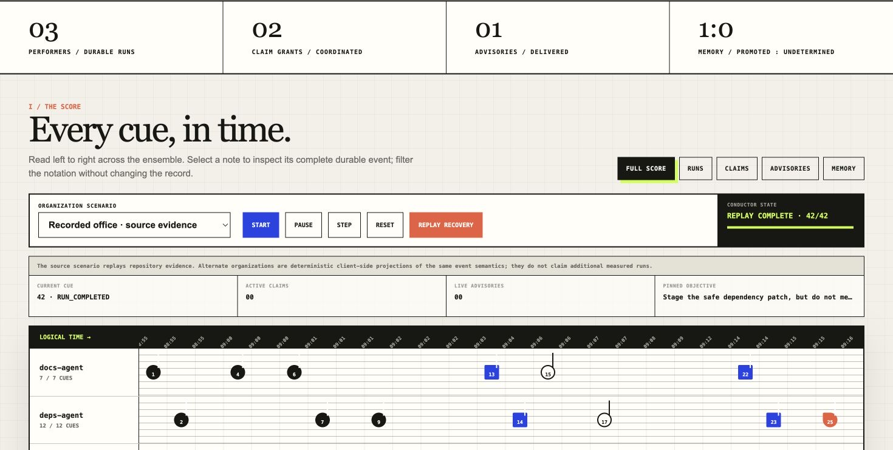

# BATON

BATON turns long-running agent loops into a small, auditable organization. Its
single-node runtime provides durable SQLite events and checkpoints, versioned
handoffs with verbatim-pinned objectives/constraints/advisories, externally
scheduled routines, budget enforcement, eval-gated lessons, TTL claims,
structured advisories, objective updates, and one fleet timeline.

It is an agent-runtime harness, not an agent framework: the compact MVP ships
deterministic recorded loops and no model SDK.

## Journey 0

```bash
git clone https://github.com/Aneesh-Pothuru/baton
cd baton
make demo
```

The keyless recorded morning contains:

1. `docs-agent`, `deps-agent`, and `sre-agent` routines firing;
2. docs receiving the `repo:portfolio` claim while deps queues;
3. SRE publishing `infra.deploy-pipeline`, docs releasing the claim, and deps
   receiving both the claim and advisory at its next step boundary;
4. deps recording a paused-merge reaction and a human objective update;
5. a promoted lesson whose candidate scores beat its source episodes;
6. a tool-boundary checkpoint, actual SQLite connection close/reopen, and
   restoration of workspace ref, harness state, and pinned handoff;
7. an interactive conductor score at `docs/demo/index.html`.

Generated evidence is in `reports/baton.sqlite` and
`reports/compounding.json`. GitHub Pages serves a complete product site from
[docs/index.html](docs/index.html), with the product thesis, implementation
proof, architecture and limits, and a keyless interactive replay.

The score embeds the exact 42-event source record generated by Python. Its
transport can start, pause, step, reset, filter, or replay recovery; alternate
organization choices are explicitly labeled deterministic client-side
projections of the same event semantics, not additional measured runs.



## Commands

```bash
make demo                    # deterministic three-agent Journey 0
make test                    # standard-library unittest suite
make lint                    # compile + repository hygiene checks
make reproduce-compounding  # rerun the declared lesson-gate fixture
make reproduce-resume       # 100 close/reopen boundary-resume trials
```

`baton fire <routine>` is represented by `Runtime.fire_routine`; GitHub Actions
cron calls the same CLI surface in a deployed routine. Claims are enforced for
BATON-dispatched work in this process, use owner tokens for compare-and-delete,
and queue contenders. They are not operating-system file locks.

The vendored [loopkit schema](schemas/loopkit.schema.json) defines portable
run/trace/verdict records. The complete brief is in
[docs/BRIEF.md](docs/BRIEF.md). Measured and unmeasured boundaries are explicit
in [LIMITS.md](LIMITS.md). The visual research and product-specific design thesis
are in [docs/COMPETITIVE_UI.md](docs/COMPETITIVE_UI.md), and the four primary
operator paths are mapped in [docs/USER_JOURNEYS.md](docs/USER_JOURNEYS.md).
